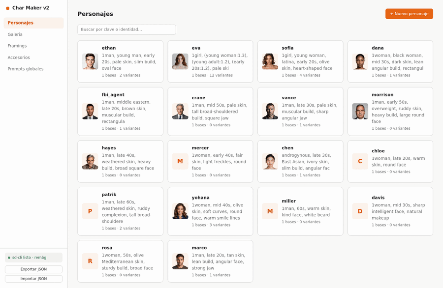
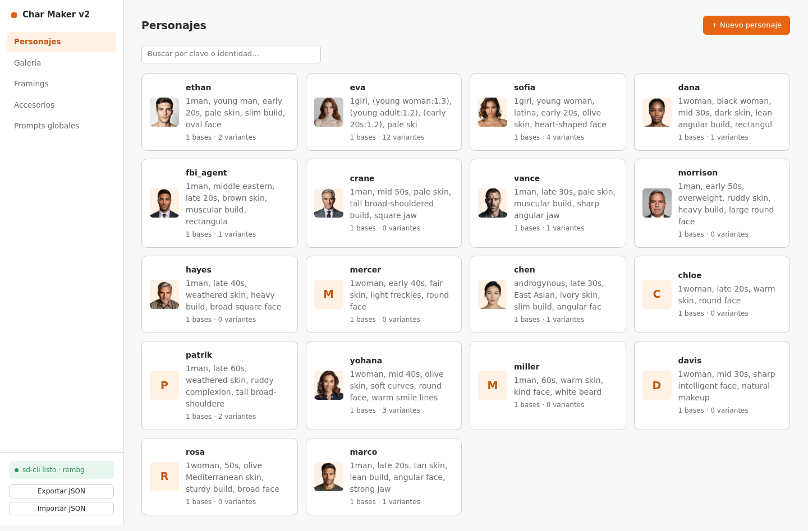
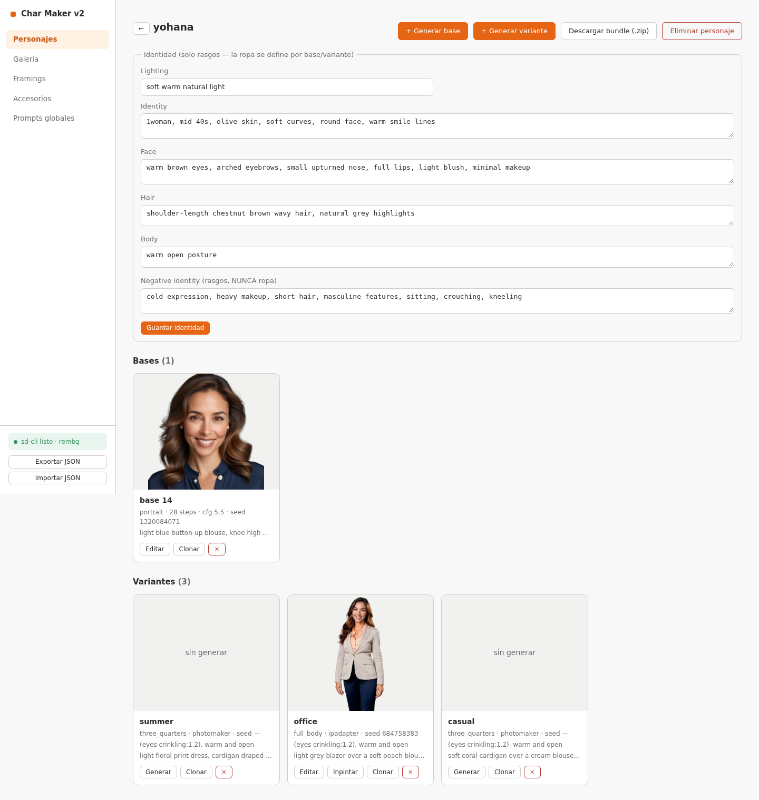
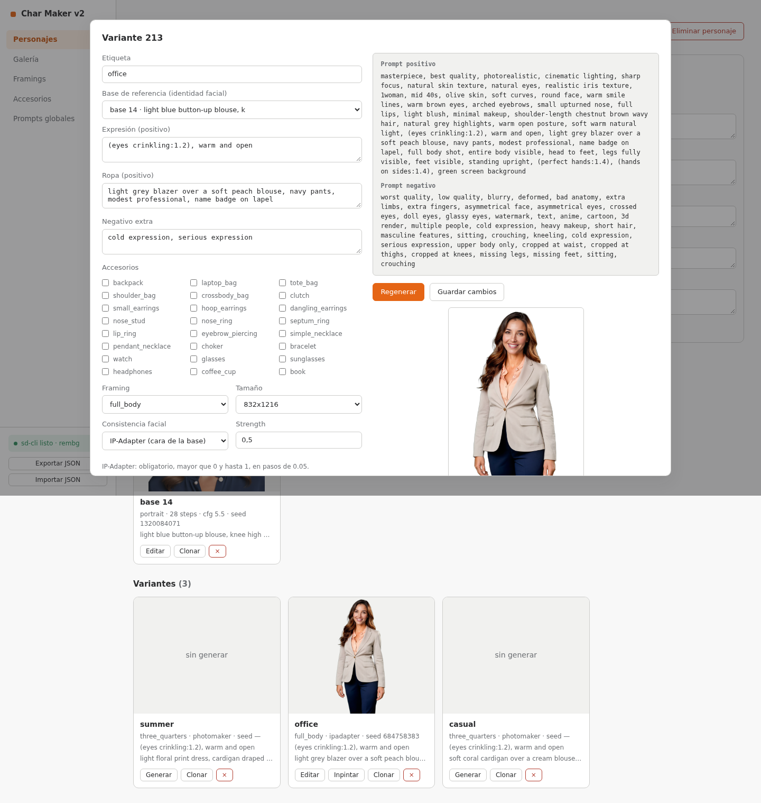
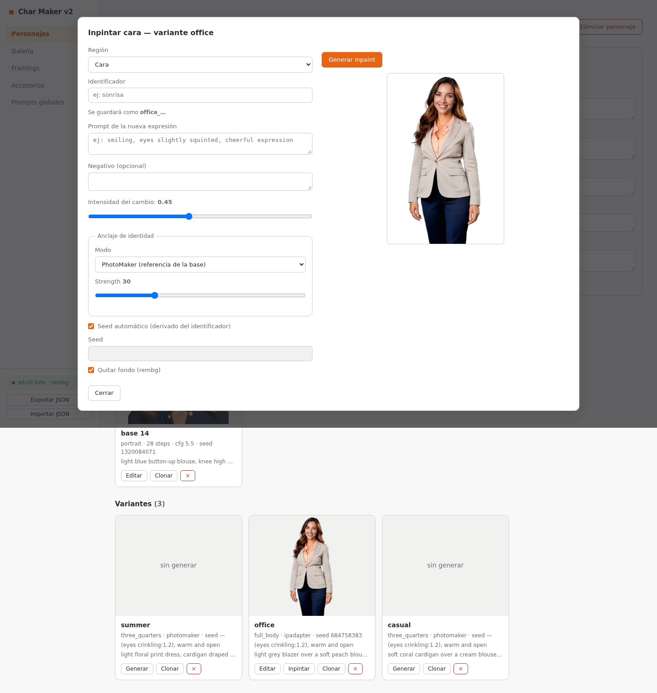

# CharMaker2

[English](README.md) · **Español**

[](https://buymeacoffee.com/jsnoriegam)

Aplicación web para **generar personajes de visual novels** con stable-diffusion.cpp
(`sd-cli`). No es un formulario de generación: es un **gestor de personajes** donde
cada personaje se arma, se le genera una **base** (referencia facial) y de ahí salen
sus **variantes** (expresión + ropa + accesorios + encuadre). Sobre una variante se
pueden hacer **inpaints** de regiones (p. ej. la cara) para corregir o cambiar la
expresión. Todo el material de trabajo vive en **SQLite** y se edita desde la UI.

## Capturas



| Personajes | Detalle de personaje |
| :---: | :---: |
|  |  |

| Modal de variante con preview en vivo | Modal de inpaint |
| :---: | :---: |
|  |  |

## Conceptos

- **Personaje**: identidad fija (`identity`, `face`, `hair`, `body`, `lighting`) +
  `negative_identity` reservado **solo para rasgos**. La ropa nunca toca la
  identidad: así no aparecen contradicciones del estilo "shirtless en el negativo
  de identity y shirtless en el prompt".
- **Base**: retrato de referencia (800×800 → crop 512 + rembg). Guarda su propia
  ropa, seed, modelo, sampler, etc. — la base _es_ el preset.
- **Variante**: expresión + ropa + accesorios + framing + método de consistencia
  facial (PhotoMaker/IP-Adapter tomando la cara de una base). También guarda su
  propia configuración de generación; `Regenerar` retoca y vuelve a generar,
  `Clonar` duplica para experimentar sin tocar el original.
- **Inpaint**: corrección de una región de una variante con `-M adetailer`
  (denoise + prompt propio). Se ancla la identidad con `none`, `prompt`,
  PhotoMaker o IP-Adapter. El **identificador** que le das es único por variante:
  regenerar con el mismo lo **sobrescribe** (la imagen anterior va a `_history`).
- **Framings / Accesorios / Prompts globales**: CRUDs propios en el menú.
- **Preview en vivo**: cada modal muestra el positivo/negativo final que se va a
  mandar a sd-cli, con un aviso de **conflictos** (términos que aparecen en ambos
  lados).
- **Cierre seguro**: al cerrar una base/variante/inpaint con cambios sin guardar,
  pregunta si guardarlos antes de cerrar (Guardar / Descartar / Cancelar).

## Requisitos

- Node.js 22+ (usa `node:sqlite` nativo). Se puede instalar con npm o bun.
  `sharp` trae libvips como binario prebuilt: no requiere compilar nada.
- **sd-cli** compilado (stable-diffusion.cpp) y checkpoints SDXL.
- Frontend: **Alpine.js** (incluido en `public/vendor/`, sin build step).
- (Opcional) Python 3 para el `.venv` de rembg: `bash scripts/setup-rembg.sh`
  instala rembg, descarga el modelo BiRefNet-general y lo deja en
  `~/.rembg/models/birefnet-general/` (el binario se resuelve: `REMBG_BIN` →
  `.venv/bin/rembg` → PATH).

## Uso

```bash
cd charmaker2
bun install            # o: npm install
cp .env.example .env   # ajustar rutas de sd-cli/modelos
bun run dev            # http://127.0.0.1:3002
```

El server escucha en `127.0.0.1:3002` por defecto (no expuesto a la LAN). Para
acceder desde otro equipo usá `SERVER_HOST=0.0.0.0`, sabiendo que no hay auth.

Al arrancar con la DB vacía, siembra automáticamente desde `character_data.js`
(el set **genérico de ejemplo**): personajes de muestra, 1 base por personaje
(ropa del outfit `base`) y 1 variante por outfit (sin imagen — se generan on
demand). Después de eso la DB es la única fuente de verdad; `bun run seed`
re-emplaza todo con `--force`.

Si tenés tus propios personajes y no querés publicarlos, ponelos en
`character_data.local.js` (ignorado por git): si existe, tiene prioridad sobre
`character_data.js` tanto en el arranque como en `bun run seed`. Ver
`loadCharacterData()` en `seed.js`.

Desde la vista de un personaje podés descargar un **bundle `.zip`** con todas las
imágenes generadas: `{name}_base.png`, `{name}_{variant}.png` y
`{name}_{variant}_{inpaint}.png`. Si dos archivos quedan con el mismo nombre, gana
el más reciente.

## Arquitectura

```
charmaker2/
├── server.js                # entrypoint Express + auto-seed + shutdown ordenado
├── db.js                    # node:sqlite: schema y capa de datos
├── seed.js                  # character_data(.local).js → DB (CLI o automático)
├── character_data.js        # set genérico del seed, nunca en runtime
├── character_data.local.js  # personajes personales (ignorado por git, opcional)
├── server/
│   ├── config.js            # todas las variables de entorno (dotenv)
│   ├── jobs.js              # cola FIFO + eventos SSE + TTL de jobs
│   ├── prompts.js           # armado de capas positivo/negativo + conflictos
│   ├── sdcli.js             # construcción de argv de sd-cli + runner
│   ├── rembg.js             # resolución y ejecución de rembg
│   ├── util.js              # crud helper, dirs, historial, limpieza de huérfanos
│   ├── pipeline/            # base.js · variant.js · inpaint.js
│   └── routes/              # characters · items · gallery · prompt-data · generate · meta
├── public/                  # SPA Alpine (index.html + app.js + style.css + vendor/)
├── scripts/setup-rembg.sh
├── tests/                   # node --test
├── data/charmaker2.db       # se crea solo (ignorado por git)
└── generated/<char>/{bases,variants,inpaints,_stages,_history}/   # ignorado por git
```

### Armado del prompt (capas)

```
positivo = GLOBAL + identity, face, hair, body, lighting, [expression], clothing,
           accessories.pos, framing.pos
negativo = GLOBAL_NEG + negative_identity + negative_extra(item) +
           framing.neg + accessories.neg
```

`negative_extra` es por base/variante: ahí va el contrario de la ropa elegida
(ej: variante "bikini" → `fully clothed, shirt on`).

El inpaint reusa el prompt de escena de la variante como contexto (`-p`/`-n`) y
manda el texto de la región como `--ad-prompt`; con anclaje `prompt` antepone
`identity, face, hair` del personaje al prompt de región.

### API

| Endpoint                                                                          | Método              | Descripción                                                                                                                                |
| --------------------------------------------------------------------------------- | ------------------- | ------------------------------------------------------------------------------------------------------------------------------------------ |
| `/api/characters[/:key]`                                                          | GET/POST/PUT/DELETE | CRUD personajes (borrar elimina también su carpeta de imágenes)                                                                            |
| `/api/characters/:key/bundle`                                                     | GET                 | `.zip` con todas las imágenes generadas (`{name}_base.png`, `{name}_{variant}.png`, `{name}_{variant}_{inpaint}.png`)                      |
| `/api/bases?character=` · `/api/variants?character=` · `/api/inpaints?character=` | GET                 | listas del personaje                                                                                                                       |
| `/api/bases/:id/clone` · `/api/variants/:id/clone`                                | POST                | duplica fila + imagen con id nuevo                                                                                                         |
| `/api/bases/:id` · `/api/variants/:id`                                            | PUT/DELETE          | editar datos / borrar fila + archivo + stages                                                                                              |
| `/api/inpaints/:id`                                                               | PUT/DELETE          | editar config / borrar inpaint + archivo + stages                                                                                          |
| `/api/suggestions?character=`                                                     | GET                 | valores ya usados (datalists del modal)                                                                                                    |
| `/api/preview`                                                                    | POST                | positivo/negativo + conflictos para un _borrador_ (el modal lo llama debounced)                                                            |
| `/api/framings[/:key]` · `/api/accessories[/:key]`                                | GET/POST/PUT/DELETE | CRUD colecciones                                                                                                                           |
| `/api/globals`                                                                    | PUT                 | segmentos globales                                                                                                                         |
| `/api/prompt-data`                                                                | GET/PUT             | export / import JSON completo (el import limpia imágenes huérfanas)                                                                        |
| `/api/gallery`                                                                    | GET                 | metadata de todas las imágenes (sin prompts)                                                                                               |
| `/api/gallery/:kind/:id`                                                          | GET                 | prompt resuelto de una imagen (`base`\|`variant`\|`inpaint`)                                                                               |
| `/api/generate-base`                                                              | POST                | `{character, baseId?, clothing, ...}` → job                                                                                                |
| `/api/generate-variant`                                                           | POST                | `{character, baseId, variantId?, expression, clothing, accessories, framingKey, method, strength, ...}`                                    |
| `/api/inpaint-variant`                                                            | POST                | `{variantId, label, region, prompt, negative, denoise, identityMode, ...}` → job (el `label` es único por variante: regenerar sobrescribe) |
| `/api/jobs`                                                                       | GET                 | jobs activos/encolados (para rehidratar el seguimiento tras un refresh)                                                                    |
| `/api/generate/:id/stream` · `/cancel` · `/:id`                                   | GET/POST            | SSE (incluye `queuePosition`), detener, estado                                                                                             |
| `/api/config` · `/api/models`                                                     | GET                 | entorno + checkpoints disponibles                                                                                                          |

### Generación

- Cola **FIFO exclusiva** de GPU (una job a la vez); progreso por SSE parseando
  stdout de sd-cli; TTL de jobs terminados 10 min.
- `GET /api/jobs` permite reenganchar el seguimiento tras un refresh. No se puede
  encolar dos veces la misma base/variante (409 si ya hay un job en curso).
- Variante: 1er pase `img_gen` (escena/ropa/fondo) + 2do pase `-M adetailer` con
  PhotoMaker/IP-Adapter **solo sobre la cara** (requiere `SD_AD_FACE_MODEL`).
  `method: none` omite el segundo pase. `SD_AD_FACE_STEPS` ajusta los steps del 2º pase.
- Inpaint: `-M adetailer` sobre la región detectada, con `denoise` (0.05–0.95) y
  prompt propios; la fuente es el stage sin fondo de la variante (o la imagen final).
  El identificador identifica al inpaint dentro de su variante: regenerar con el
  mismo lo sobrescribe (misma fila e imagen; la anterior pasa a `_history`).
- La referencia de identidad es la imagen de la base elegida; si tiene fondo
  transparente (rembg) se aplana sobre blanco antes de usarla.
- Al regenerar sobre una base/variante existente, la imagen anterior se mueve a
  `generated/<char>/_history/` (se conservan `SD_HISTORY_KEEP`, default 5).
- ADetailer de manos: fuera del scope por ahora.

## Desarrollo

```bash
npm test            # node --test tests/*.test.js
node --test tests/prompts.test.js   # un solo archivo
npm run lint        # ESLint (flat config)
npm run format      # Prettier (opt-in)
npm run watch       # dev con node --watch
```

Los tests usan una DB temporal (cambiando el `cwd` antes de importar `db.js`), así
que no tocan `data/` ni `generated/`. CI (`.github/workflows/ci.yml`) corre lint +
test con Bun y Node 22. El server cierra ordenadamente con `SIGINT`/`SIGTERM`
(mata los `sd-cli` en curso y cierra SQLite).

## Variables de entorno

Los ajustes habituales de SDXL/stable-diffusion.cpp (`SD_BINARY`, `SD_MODEL_DIR`,
`SD_DEFAULT_MODEL`, VAE, caché, `SD_AD_FACE_MODEL`, `SD_PHOTOMAKER_PATH`,
`SD_IP_ADAPTER_PATH`, `SD_CLIP_VISION_PATH`…). Además: `REMBG_BIN`,
`REMBG_MODEL` (default `birefnet-general`), `SD_AD_FACE_STEPS` (steps del 2º
pase; si se omite usa los de la fila), `SD_HISTORY_KEEP`, `SD_STAGES_TTL_HOURS`
(purga opcional de intermedios `_stages`; 0 = deshabilitado) y
`SERVER_HOST`/`SERVER_PORT` (default `127.0.0.1:3002`; usar
`SERVER_HOST=0.0.0.0` para exponer en LAN). Ver `.env.example`.

`scripts/setup-rembg.sh` precarga el modelo BiRefNet-general en
`<home>/models/birefnet-general/birefnet-general.onnx`, donde `<home>` se
resuelve igual que en rembg: `U2NET_HOME` → `REMBG_HOME` → `$XDG_DATA_HOME/rembg`
→ `~/.rembg`. Se puede omitir con `REMBG_SKIP_MODEL=1`; si falta, rembg lo
descarga solo al primer uso.

## Seguridad

No hay autenticación: cualquiera con acceso al puerto puede lanzar jobs de GPU,
importar/borrar datos y leer las imágenes. Por eso el default es solo localhost;
exponer en LAN queda bajo tu responsabilidad.

## Enlaces relevantes

- [stable-diffusion.cpp (`sd-cli`)](https://github.com/leejet/stable-diffusion.cpp) —
  el motor de inferencia que usa CharMaker2.
- [Releases de stable-diffusion.cpp](https://github.com/leejet/stable-diffusion.cpp/releases) —
  binarios precompilados e instrucciones de build.
- [PhotoMaker](https://github.com/TencentARC/PhotoMaker) e
  [IP-Adapter](https://github.com/tencent-ailab/IP-Adapter) — modelos opcionales de
  consistencia facial (2º pase).
- [rembg](https://github.com/danielgatis/rembg) — quitado de fondo opcional.
- [Alpine.js](https://alpinejs.dev/) — framework del frontend (vendorizado, sin build step).
- [Express](https://expressjs.com/) y
  [`node:sqlite`](https://nodejs.org/api/sqlite.html) — stack del backend.

## Soporte

Si CharMaker2 te resulta útil, podés apoyar su desarrollo invitándome un café
en [Buy Me a Coffee](https://buymeacoffee.com/jsnoriegam). ¡Gracias!

## Licencia

CharMaker2 está licenciado bajo la
[Licencia Creative Commons Atribución-NoComercial-CompartirIgual 4.0 Internacional
(CC BY-NC-SA 4.0)](https://creativecommons.org/licenses/by-nc-sa/4.0/). Ver
[LICENSE](LICENSE) para el texto legal completo.

Podés compartir y adaptar el material con fines no comerciales dando el crédito
correspondiente, y las obras derivadas deben distribuirse bajo la misma licencia.
